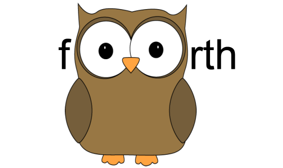

The fOOrth language is an experimental variant of FORTH that attempts to
incorporate object oriented and functional programming concepts. It also
tries to extrapolate an alternate reality where FORTH was not frozen in the
past, but continued to grow and develop with the times. Above all this project
is the result of nearly 30 years of thought on the design of threaded
compilers and languages with simplified grammars and syntax.

## Community

While it is still very much a work in progress, you are invited to see The
fOOrth Programming Language web site at:
<br>http://www.foorth.org/
<br>

## Installation

Add this line to your application's Gemfile:

```ruby
gem 'fOOrth'
```

And then execute:

    $ bundle

Or install it yourself as:

    $ gem install fOOrth

The fOOrth gem itself is found at: ( https://rubygems.org/gems/fOOrth )

## Usage
Adding fOOrth can be as simple as:

    require 'fOOrth'
    XfOOrth.main

This will launch an interactive fOOrth session. Alternatively this can be
done with:

    $ fOOrth

or

    $ rake run

Be sure to be in the folder that contains the rakefile in order for the latter
command to work.

<br>If, instead, a non-interactive facility is required, use:

    require 'fOOrth'
    XfOOrth.virtual_machine.process_string '1 2 +'

where the string is fOOrth code to be executed, or for a file of code, use:

    require 'fOOrth'
    XfOOrth.virtual_machine.process_file 'my_file.foorth'

## Further Documentation

The fOOrth Language System is documented in The fOOrth User Guide. This is
currently only available in Open Office and PDF formats. The guide tracks
changes in the language fairly closely. The most current guide in PDF
format may be found at the community web site above.

This code repo also has PDF formatted guides for major revisions.

### If you get stuck.

The fOOrth language REPL has several commands inspired by the APL interpreter 
of the old PDP-10 system I used so many years ago. The commands take the form
of )command. That's a right paren then the command name. Some useful ones
to know are:

    )"shell command"   -- execute the specified command in the shell.
    )classes           -- list the system classes.
    )globals           -- list any global variables.
    )load"filename"    -- load the fOOrth file called filename.
    )irb               -- launch an interactive irb debug session.
    )quit              -- exit fOOrth.
    )time              -- display the current time.
    )show              -- after each command show the contents of the data stack.
    )noshow            -- don't do that.
    )version           -- display current language version info.
    )words             -- list all defined method names.
    

## Contributing

#### Plan A

1. Fork it ( https://github.com/PeterCamilleri/fOOrth/fork )
2. Switch to the development branch ('git branch development')
3. Create your feature branch ('git checkout -b my-new-feature')
4. Commit your changes ('git commit -am "Add some feature"')
5. Push to the branch ('git push origin my-new-feature')
6. Create new Pull Request


For more details on the branching strategy, please see:
http://nvie.com/posts/a-successful-git-branching-model/


#### Plan B

Go to the GitHub repository and raise an issue calling attention to some
aspect that could use some TLC or a suggestion or an idea.
